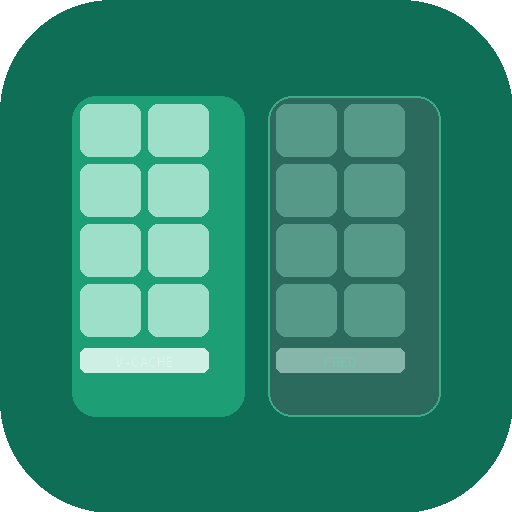

     

# X3D CCD Optimizer

A free, open-source Windows tool that gives you visibility and control over CCD scheduling on AMD Ryzen processors. Real-time dashboard, automatic game detection, background process management, and a compact gaming overlay. Supports all Ryzen processors from single-CCD standard to dual-CCD X3D.

## Why Does This Exist?

AMD and Microsoft have built scheduling improvements that work behind the scenes -- CPPC preferred cores, the 3D V-Cache driver, GameMode power profiles. These are good. But they give users no visibility into what's happening and no direct control when things don't work as expected.

This tool adds transparency and explicit management on top of AMD's existing system. It doesn't replace AMD's drivers -- it supplements them. You can see exactly which CCD your game is running on, which processes are where, and take direct action if needed.

For the full technical breakdown, see the Wiki: [AMD X3D Scheduling Explained](../../wiki/AMD-X3D-Scheduling-Explained).

## Features

- **Real-time CCD dashboard** -- per-core load heatmaps, frequency display, grouped process router with game badges
- **Automatic game detection** -- 500+ game database (known games + Steam/Epic launcher scan) + GPU heuristic fallback. Known games detected instantly by process name, no GPU threshold needed
- **Two optimization strategies** -- Driver Preference (AMD's V-Cache driver registry) or Affinity Pinning (direct CPU affinity masks). Driver Preference recommended for X3D processors
- **Process Rules** -- pin games to V-Cache CCD, pin background apps (Discord, browsers, OBS) to Frequency CCD
- **Live Process Picker** -- see what's running on your system, tick what to manage, add to rules
- **Continuous monitoring** -- 3-second scan loop catches newly launched processes and migrates them automatically
- **Background migration in both strategies** -- background apps get pinned regardless of whether the game uses Driver Preference or Affinity Pinning
- **Compact gaming overlay** -- always-on-top CCD load display with OLED burn-in protection. Toggle with Ctrl+Shift+O
- **4-tier processor support** -- DualCcdX3D, SingleCcdX3D, DualCcdStandard, SingleCcdStandard
- **Safe by default** -- Monitor mode observes without changing anything. Optimize is opt-in
- **Dirty shutdown recovery** -- affinities restored automatically even after crashes
- **Runs elevated with full transparency** -- open source, no telemetry, no network connections

## Screenshots

<!-- TODO: Add screenshots -->
<!--  -->
<!--  -->
<!--  -->
<!--  -->

## Quick Start

1. Download the latest release from [Releases](../../releases)
2. Run the exe -- accept the UAC prompt (admin rights required for CPU affinity)
3. The app starts in **Monitor mode** -- it observes your CPU without changing anything
4. Open **Settings > Process Rules** to configure which games go to V-Cache and which background apps go to Frequency CCD
5. Toggle to **Optimize** when you're ready to actively manage CCD affinity

## Supported Processors

| Tier | Examples | Features |
|------|----------|----------|
| Dual-CCD X3D | 7950X3D, 7900X3D, 9950X3D, 9900X3D | Full: Driver Preference + Affinity Pinning, CCD heatmaps, background migration, overlay |
| Single-CCD X3D | 7800X3D, 9800X3D | Monitoring: per-core heatmap, game detection, overlay. No CCD steering needed (all cores share V-Cache) |
| Dual-CCD Standard | 7950X, 7900X, 9950X, 9900X, 5950X, 5900X | Affinity Pinning to either CCD, CCD heatmaps, background migration |
| Single-CCD Standard | 7600X, 7700X, 5600X, 5800X, etc. | Monitoring: per-core heatmap, overlay |

## Requirements

- **OS:** Windows 10/11 64-bit
- **Runtime:** [.NET 8 Desktop Runtime](https://dotnet.microsoft.com/en-us/download/dotnet/8.0) (or use the self-contained build)
- **CPU:** AMD Ryzen processor
- **Elevation:** Administrator rights (required for process affinity and driver registry access)

## Documentation

Full documentation is available on the [Wiki](../../wiki):

- [AMD X3D Scheduling Explained](../../wiki/AMD-X3D-Scheduling-Explained) -- how CPPC, V-Cache driver, and core parking work together
- [How It Works](../../wiki/How-It-Works) -- architecture and detection pipeline
- [FAQ](../../wiki/FAQ) -- common questions and troubleshooting
- [Process Rules Guide](../../wiki/Process-Rules-Guide) -- configuring game and background app rules

## How It Works

On startup, the app detects your CPU's cache topology via `GetLogicalProcessorInformationEx` to identify CCDs, V-Cache presence, and processor tier. It then monitors running processes against the game database (manual list, 500+ known games, Steam/Epic launcher scan) and GPU usage heuristics.

In **Monitor mode**, everything is observe-only -- the dashboard shows what the app *would* do. In **Optimize mode**, the selected strategy takes effect: Driver Preference sets AMD's registry key to prefer the V-Cache CCD, while Affinity Pinning directly sets CPU affinity masks. Background processes are migrated to the Frequency CCD in both strategies. When the game exits, all changes are restored. Every action is logged with timestamps and detection source.

## FAQ

**Is it safe?**
Yes. Monitor mode changes nothing. Optimize mode uses standard Windows APIs (`SetProcessAffinityMask`) and AMD's own driver registry interface. All changes are reversed when the game exits. Dirty shutdown recovery handles crashes.

**Why does it need admin rights?**
Windows requires administrator privileges to set CPU affinity on other processes and to write to the AMD driver's HKLM registry key. The app is fully open source -- audit every line.

**Does it work with anti-cheat?**
Driver Preference (recommended) does not modify any game process -- it only sets a registry key that AMD's driver reads. Affinity Pinning modifies the game's CPU affinity mask, which is a standard Windows feature but may interact with aggressive anti-cheat systems. Use Driver Preference for competitive online games.

**How is this different from Process Lasso?**
Process Lasso is a general-purpose process manager with no awareness of X3D CCD topology, no automatic game detection, no V-Cache driver integration, and no visual CCD dashboard. This tool is purpose-built for the AMD Ryzen CCD scheduling problem.

**Is this AI-generated?**
The architecture and design decisions are by [LordBlacksun](https://github.com/LordBlacksun). Implementation is generated by [Claude Code](https://claude.ai/claude-code) under human supervision. Every change is reviewed, tested on real hardware, and approved before commit. See [How This Was Built](#how-this-was-built) for details.

## Disclaimer

X3D CCD Optimizer modifies CPU affinity and/or AMD driver registry preferences to optimize CCD scheduling. While these are standard Windows and AMD features, the developer provides this software as-is with no warranty. The developer assumes no liability for any consequences including but not limited to: anti-cheat detection, game bans, system instability, or data loss. Use at your own risk. See [LICENSE](LICENSE) (GPL v2) for full terms.

## Contributing

Contributions are welcome. See [CONTRIBUTING.md](CONTRIBUTING.md) for guidelines.

The known games database (`src/X3DCcdOptimizer/Data/known_games.json`) is a great place to start -- adding game executables helps everyone.

## How This Was Built

This project is conceived, designed, and architecturally directed by LordBlacksun. Implementation is generated by [Claude Code](https://claude.ai/claude-code) (Anthropic's AI coding tool) under human supervision.

- LordBlacksun defines the architecture, makes all design decisions, and sets the project direction
- Claude Code generates the implementation following the [blueprint](X3D_CCD_OPTIMIZER_BLUEPRINT.md) and coding conventions
- Every change is reviewed, tested on real hardware, and approved before commit
- The workflow is "build freely, approve before commit" -- the AI proposes, the human disposes

AI-assisted development is a legitimate way to build software. The code works, the architecture is sound, and every line has been reviewed. But AI-generated code can have blind spots -- community code reviews and contributions are actively welcomed.

## Credits

- [cocafe/vcache-tray](https://github.com/cocafe/vcache-tray) -- for discovering and documenting the AMD V-Cache driver registry interface. The Driver Preference strategy builds on their work.
- AMD -- for CPPC, the 3D V-Cache driver, and the scheduling infrastructure this tool builds on.
- Inspired by the Linux community's [x3d-toggle](https://github.com/pyrotiger/x3d-toggle) and the `amd_x3d_vcache` kernel driver.

## License

GPL v2. See [LICENSE](LICENSE) for details.

## Code Signing

<!-- Free code signing provided by [SignPath.io](https://signpath.io), certificate by [SignPath Foundation](https://signpath.org). -->
Code signing via SignPath is planned for a future release.
